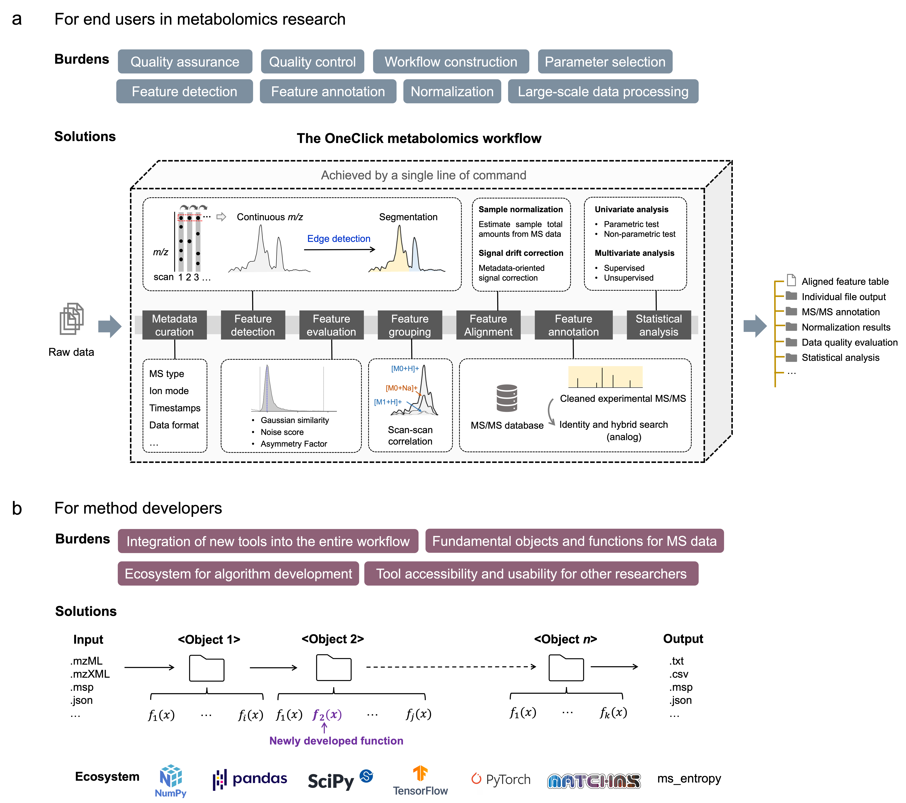

  

MassCube is an end-to-end mass spectrometry data processing framework designed for both end users in metabolomics research and developers in the field of mass spectrometry. 

It helps manage everything from individual files to ultra-large metabolomics studies involving more than 10,000 injections.

## MassCube enables

* **Untargeted feature detection**
    * Accurate and comprehensive feature detection, with accurate annotation of isotopes, charge states,
    adducts, and in-source fragments.

* **Comprehensive feature evalution**
    * Understand chromatographic peak shapes using Gaussian similarity, noise score, asymmetry factor and more.

* **Compound annotation and analog search**
    * Ultra-fast annotation of MS/MS spectra with high confidence, suppoted by entropy similarity.

* **Data visualization**
    * Visualize the data in a variety of ways and generate publication-quality graphs, including chromatograms, 
    single spectrum, MS/MS matching plots, PCA plots and more.
   
* **Flexible development and implementation**
    * A variety of fundemental algorithms are available for flexible usage, including data normalization, network analysis, and statistical analysis.

## Explore


  
  
  
  

