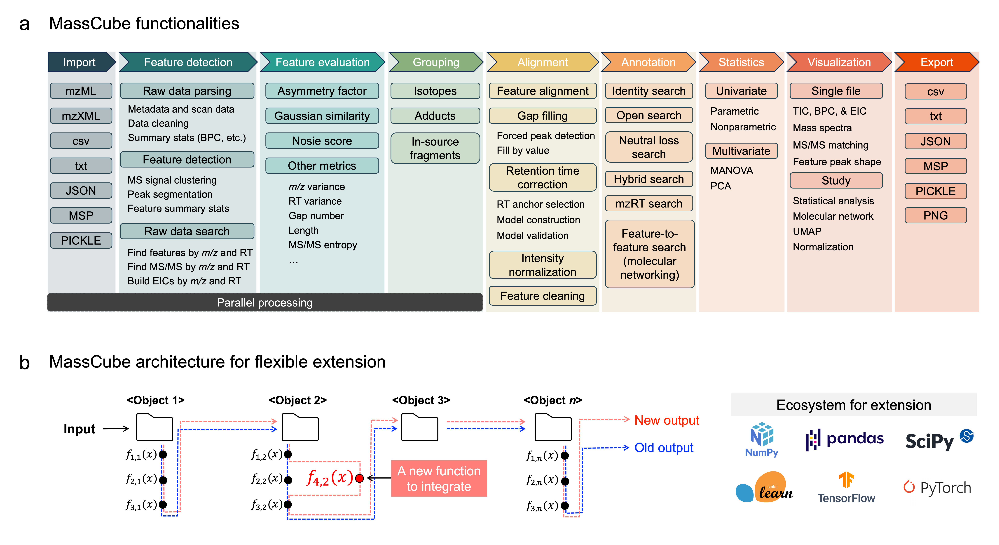

  

MassCube is an end-to-end mass spectrometry data processing framework designed for both end users in metabolomics research and developers in the field of mass spectrometry.

It helps manage everything from individual files to ultra-large metabolomics studies involving more than 10,000 injections.

## MassCube enables

- **Untargeted feature detection**

  - Accurate and efficient feature detection, with annotation of feature groups including isotopes,
    adducts, and in-source fragments.

- **Comprehensive feature evalution**

  - Understand chromatographic peak shapes using Gaussian similarity, noise score, asymmetry factor and more.

- **Compound annotation and analog search**

  - Ultra-fast annotation of MS/MS spectra by identity search, fuzzy search, and mz-RT matching.

- **Data visualization**

  - Visualize the data in a variety of ways and generate publication-quality graphs, including chromatograms,
    single spectrum, MS/MS matching plots, UMAP plots and more.

- **Flexible development and implementation**
  - Fundemental object and function design allows for easy extension and customization.

## Explore








## Cite

Yu, H., Ding, J., Shen, T. et al. MassCube improves accuracy for metabolomics data processing from raw files to phenotype classifiers. Nat Commun 16, 5487 (2025). https://doi.org/10.1038/s41467-025-60640-5
