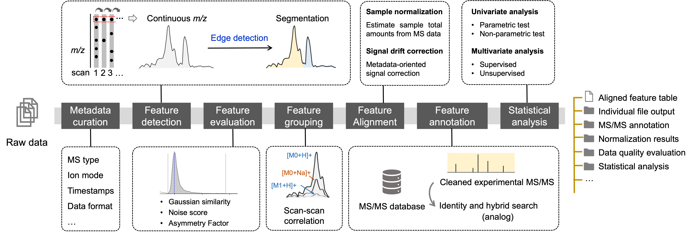

Let’s dive into the untargeted metabolomics workflow, designed to simplify and streamline untargeted metabolomics analysis. This powerful workflow delivers comprehensive results with just a single command.

If you haven’t installed MassCube yet, be sure to follow the [installation guide](../installation) before proceeding.

## The MassCube untargeted metabolomics workflow

The workflow integrates metadata curation, feature detection, evaluation, alignment, annotation, and statistical analysis to provide users with a comprehensive view of the data (**Fig. 1**).



{}

### Input (3+1)

You need <u>three components</u> for the project plus <u>one MS/MS library</u> for annotation.

In your project folder (e.g. **my_project**), you need to prepare the following components:

```
my_project
├── data
│   ├── sample1.mzML
│   ├── sample2.mzML
|   └── ...
|── sample_table.csv
└── parameters.csv
```

1. `data` folder: a file folder containing all raw LC-MS data in <u>.mzML</u> or <u>.mzXML</u> format. It's **mandatory**. Instructions for file conversion are provided [here](../workflows/data_preparation).

2. `sample_table.csv` file: a csv file to claim the sample groups including biological groups, quality control samples, or blank samples. A template can be downloaded from [here](https://github.com/huaxuyu/masscubedocs/blob/main/content/docs/sample_table.csv). You could also use MassCube to [generate](../workflows/data_preparation) a sample table and edit. If not provided, normalization and statistical analysis will not be applied. **Note:** In sample table, please specify if a sample is blank or qc from the "is_blank" and "is_qc" columns, respectively.

3. `parameters.csv` file: a csv file to set parameters for the workflow. You can set parameters and download the file for the workflow from [here](https://huaxuyu.github.io/masscube_parameters/) or download a template [here](https://github.com/huaxuyu/masscubedocs/blob/main/content/docs/parameters.csv). If not provided, the [default parameters](../workflows/parameters) will be applied, yet **annotation will not be performed since the MS/MS library is not provided**.

4. **MS2 database**: To annotate MS/MS spectra, you need to download a MS/MS library from [here](https://zenodo.org/records/14991522). For faster database loading, please download and use the .pkl format.


For MassCube version 1.2.0 or later, please use [New MS/MS Databases](https://zenodo.org/records/14991522)
For the earlier version, please use [Old MS/MS Databases](https://zenodo.org/records/11363475)


**Extra component for annotation:**

1. `mzrt_list.csv` file: a csv file to provide the m/z and retention time for feature annotation. It was designed to annotate features using retention time (e.g. internal standards). A template can be downloaded from [here](https://github.com/huaxuyu/masscubedocs/blob/main/content/docs/mzrt_list.csv). It's **optional**.






### Processing

**In the project folder**, open a terminal and run the following command:

```bash
untargeted-metabolomics
```


Make sure the terminal directory is set to the project folder. For [Windows user](https://johnwargo.com/posts/2024/launch-windows-terminal/) and [MacOS user](https://support.apple.com/guide/terminal/open-or-quit-terminal-apd5265185d-f365-44cb-8b09-71a064a42125/mac#:~:text=Terminal%20for%20me-,Open%20Terminal,%2C%20then%20double%2Dclick%20Terminal.)


### Output

After the processing, you will find the following files and folders in the project folder:

```
project/
├── data
├── sample_table.csv
├── parameters.csv
├── mzrt_list.csv (optional)
├── project_files
│   ├── data_processing_metadata_[DATE].pkl
│   ├── features.msp
│   └── ...
├── aligned_feature_table.txt
|── normalized_feature_table.txt (if signal normalization applied)
├── single_files
│   ├── sample1.txt
│   ├── sample2.txt
│   └── ...
├── chromatograms
│   ├── sample1.png
│   ├── sample2.png
│   └── ...
├── ms2_matching
│   ├── compound1.png
│   ├── compound2.png
│   └── ...
├── statistical_analysis
├── normalization results
|   ├──feature_0_normalization.png
|   ├──feature_1_normalization.png
|   └── ...
├── ...
```

1. `project_files` folder: a folder containing the metadata file for data processing.
2. `aligned_feature_table.txt` file: feature table after alignment (if applied).
3. `single_files` folder: a folder containing the feature table for each sample.
4. `chromatograms` folder: a folder containing the chromatogram for each sample.
5. `ms2_matching` folder: a folder containing the MS/MS matching for each annotated compound.
6. `statistical_analysis` folder: a folder containing the statistical analysis results.
7. `normalization results` folder: a folder containing the normalization results (if applied).

{}
