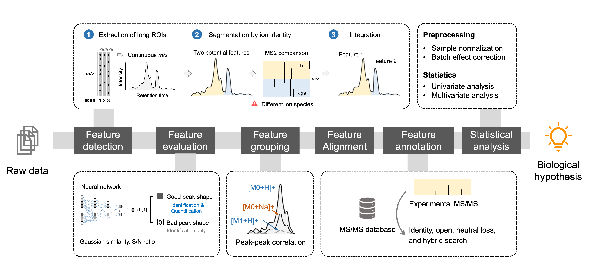

Use MassCube for common tasks in mass spectrometry data processing!

<!--more-->

## The First Time Use

### Installation of Python

Visit the [official Python website](https://www.python.org/) to download Python.


  To use the neural network model for peak shape evaluation, **Python 3.9-3.11** is required. Click here to download the [Python 3.11](https://www.python.org/downloads/release/python-3117/).


### Installation of *masscube*

The easiest way to install the masscube python package is using **pip**. Open terminal and run

```console
pip install masscube
```

Dependencies will be automatically installed. This progress may take several minutes. Consider creating a [virtual environment](https://docs.python.org/3/library/venv.html) if you're working with Python on multiple projects.


## The OneClick Untargeted Metabolomics workflow

Finish the complete untargeted metabolomics workflow (**Fig. 1**) with a single line of command.



### Input

Organize the files of a project (i.e. **my_project**) in a folder

```
my_project
├── data
│   ├── sample1.mzML
│   ├── sample2.mzML
|   └── ...
|── sample_table.csv
└── parameters.csv
```

There are three types of data

1. `data` folder: a subfolder containing all raw MS data in mzML or mzXML format. It's **mandatory**.
2. `sample_table.csv` file: a csv file to claim the name of samples and their groups including biological groups, quality control samples, or blank samples. An example is [here](). It's **mandatory**.
3. `parameters.csv` file: a csv file to set parameters for the workflow. An example is [here](). It's **optional**. If not provided, the [default parameters]() will be applied. See [Parameters]() for more details. 

### Processing

Within the project folder, open terminal and run

```
untargeted-metabolomics
```


  Make sure the terminal directory is the peoject folder. For [Windows user](https://johnwargo.com/posts/2024/launch-windows-terminal/) and [MacOS user](https://support.apple.com/guide/terminal/open-new-terminal-windows-and-tabs-trmlb20c7888/mac#:~:text=Open%20new%20Terminal%20windows%20or%20tabs%20from%20the%20Finder&text=Control%2Dclick%20the%20folder%20in,New%20Terminal%20Tab%20at%20Folder.)


### Output

A set of output files will be provided in the **project folder** depending on the parameters settings. The general output will be

```
project/
├── data
├── sample_table.csv
├── parameters.csv
├── project.mc
├── aligned_feature_table.csv
├── single_file_output
│   ├── sample1.csv
│   ├── sample2.csv
│   └── ...
├── chromatogram
│   ├── sample1.png
│   ├── sample2.png
│   └── ...
├── ms2_matching
│   ├── compound1.png
│   ├── compound2.png
│   └── ...
├── statistics
├── ...
```

1. `project.mc` file: the project file of *masscube*.
2. `aligned_feature_table.csv` file: feature table after alignment.
3. `single_file_output` folder: a file folder containing the detected features from individual files.
4.  `chromatogram` folder: a file folder to store base peak chromatograms (BPCs) for individual files.
5. `ms2_matching` folder: mirror plot of MS2 matching results.
6. `statistics` folder: results from statistical analysis. For example, principal component analysis plots.