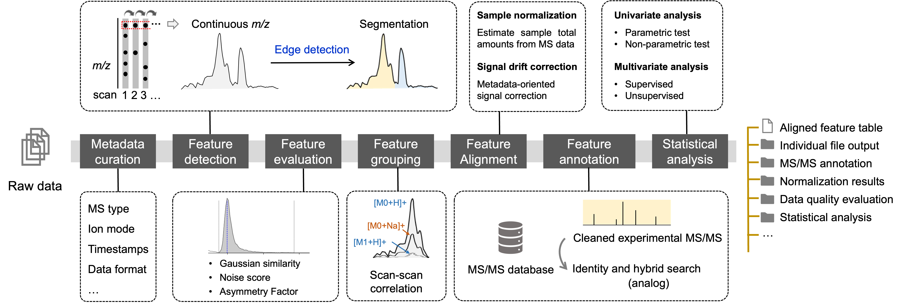

Let’s dive into the untargeted metabolomics workflow, designed to simplify and streamline untargeted metabolomics analysis. This powerful workflow delivers comprehensive results with just a single command.

If you haven’t installed MassCube yet, be sure to follow the [installation guide](../installation) before proceeding.

## The MassCube untargeted metabolomics workflow

One command to process untargeted metabolomics data (**Fig. 1**).



{}

### Input (4 items)

You will need <u>data</u>, <u>sample table</u>, <u>parameters</u>, and <u>MS/MS database</u> to run the workflow.

In your project folder (e.g. **my_project**), you need to prepare the following components:

```
my_project
├── data
│   ├── sample1.mzML
│   ├── sample2.mzML
|   └── ...
|── sample_table.csv
└── parameters.csv
```

1. `data` folder: a file folder containing all raw LC-MS data in <u>.mzML</u> or <u>.mzXML</u> format. It's **mandatory**. [File conversion instructions.](../untargeted_metabolomics/convert_ms_data).

2. `sample_table.csv` file: a csv file to claim quality control samples, blank samples and biological groups. Use MassCube to [generate a sample table](../untargeted_metabolomics/generate_sample_table) and then edit. Set **yes** in the 'is_blank' column for blank samples, and **yes** in the 'is_qc' column for quality control (QC) samples. If not provided, normalization and statistical analysis will not be applied.

3. `parameters.csv` file: [Set and download a parameter file](https://huaxuyu.github.io/masscube_parameters/). If not provided, the default parameters will be applied, but annotation will not be performed since the file location of the MS/MS library is not provided.

4. `MS/MS library`: [Download a MS/MS library](https://zenodo.org/records/17902514) for MS/MS spectral annotation. You may also [prepare your own MS/MS library](../untargeted_metabolomics/database/#prepare-a-database-for-advanced-users).


For MassCube 1.1 or earlier, please use the [old MS/MS libraries](https://zenodo.org/records/11363475)


**Extra component for annotation:**

1. `mzrt_list.csv` file: a csv file to provide the m/z and retention time for feature annotation. It was designed to annotate features using retention time (e.g. internal standards). A template can be downloaded from [here](https://github.com/huaxuyu/masscubedocs/blob/main/content/docs/mzrt_list.csv). It's **optional**.





### Processing

**In the project folder**, open a terminal and run the following command:

```bash
untargeted-metabolomics
```


Make sure the terminal directory is set to the project folder. For [Windows user](https://johnwargo.com/posts/2024/launch-windows-terminal/) and [MacOS user](https://support.apple.com/guide/terminal/open-or-quit-terminal-apd5265185d-f365-44cb-8b09-71a064a42125/mac#:~:text=Terminal%20for%20me-,Open%20Terminal,%2C%20then%20double%2Dclick%20Terminal.)


### Output

After the processing, you will find the following files and folders in the project folder:

```
my_project/
├── data
├── sample_table.csv
├── parameters.csv
├── mzrt_list.csv
├── aligned_feature_table.txt
├── normalized_feature_table.txt
├── project_files
│   ├── features.msp
│   ├── aligned_feature_table_before_annotation.txt

│   └── ...
├── single_files
│   ├── sample1.txt
│   ├── sample2.txt
│   └── ...
├── chromatograms
│   ├── sample1.png
│   ├── sample2.png
│   └── ...
├── ms2_matching
│   ├── compound1.png
│   ├── compound2.png
│   └── ...
├── statistical_analysis
├── normalization_results
│   ├── feature_1_normalization.png
│   ├── feature_2_normalization.png
│   └── ...
├── ...
```

See [explanation of output files](../untargeted_metabolomics/output) for more details.

{}
