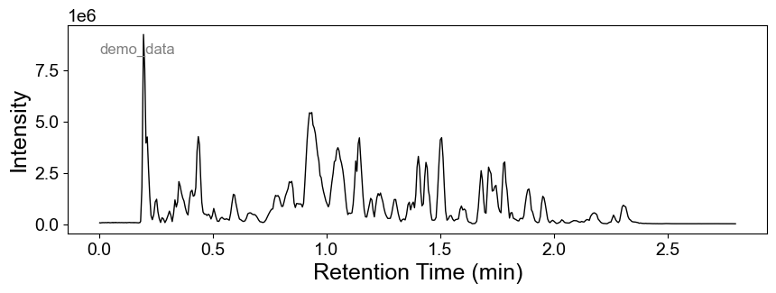
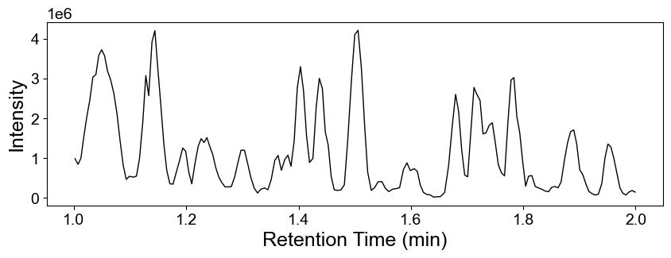
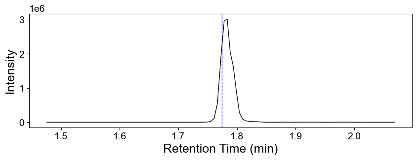
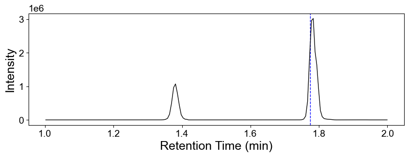

In case you need a [demo data](https://github.com/huaxuyu/masscubedocs/blob/main/static/raw_files/demo_data.mzML) file.

## Base peak chromatogram

Visualize the base peak chromatogram for a raw file:

```python
from masscube import read_raw_file_to_obj

file_name = "demo_data.mzML" # load the raw file
d = read_raw_file_to_obj(file_name)  # read the raw file into a MassCube object

# plot the base peak chromatogram
d.plot_bpc()
```

### Example output 1



Set more parameters to customize the plot:

```python
from masscube import read_raw_file_to_obj

file_name = "demo_data.mzML" # load the raw file
d = read_raw_file_to_obj(file_name)  # read the raw file into a MassCube object

# plot the base peak chromatogram
time_range = (1, 2)  # set the time range for the x-axis
label_name = False   # do not show file name in the plot
output_dir = None    # set the absolute path to save the plot, or None to show it

d.plot_bpc(
    time_range=time_range,
    label_name=label_name,
    output_dir=output_dir
)
```

### Example output 2



## Extracted ion chromatogram

Plot the extracted ion chromatogram (EIC) for a specific m/z value:

```python
from masscube import read_raw_file_to_obj

d  = read_raw_file_to_obj("demo_data.mzML")

# parameters for extracting EICs
target_mz_arr = 138.0521    # m/z value of the target ion. You can also make a list of m/z values, e.g. [138.0521, 150.1234] for
                            # overlapping EICs
target_rt = 1.774           # target retention time in minutes. Set it to None to plot the whole retention time range
mz_tol = 0.005,             # m/z tolerance in Da
rt_tol = 0.3,               # retention time tolerance in minutes
rt_range = (1,2),           # custom retention time range, e.g. (1, 2) to plot EICs in the range of 1 to 2 minutes
output_file_name = None,    # set the absolute path of the output file, or None to show the plot
show_target_rt = True,      # dashed blue line at the target retention time
ylim = None,                # custom y-axis limits, e.g. [0, 10000]
return_eic_data = False     # return the EIC data as a pandas DataFrame
                            # If True, a list of EIC data: [[eic_time_arr, eic_signals, eic_scan_idx], ...] will be returned

# example 1
d.plot_eics(target_mz_arr=target_mz_arr, target_rt=target_rt)

# example 2
d.plot_eics(target_mz_arr=target_mz_arr, target_rt=target_rt, mz_tol=mz_tol, rt_tol=rt_tol,
            rt_range=rt_range, output_file_name=None, show_target_rt=True, ylim=None,
            return_eic_data=False)
```

### Example output 1



### Example output 2


