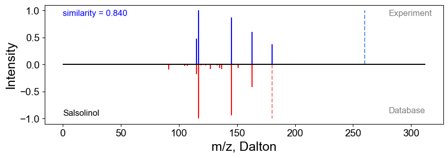

## Mirror plot

Compare a pair of MS/MS spectra using a mirror plot:

```python
from masscube.annotation import extract_signals_from_string
from masscube.visualization import mirror_ms2

precusor_1 = 260.056
precusor_2 = 180.1019
ms2_1 = "115.0538;0.1441|117.0689;0.3008|145.064;0.2618|163.0741;0.1822|180.1004;0.1111"
ms2_2 = "79.0542;0.0034|91.0542;0.0308|105.0699;0.01|107.0491;0.0075|115.0542;0.0599|117.0699;0.3268|119.0491;0.0066|123.0441;0.0046|127.0542;0.0267|133.0648;0.0052|135.0661;0.0213|137.0597;0.0277|145.0648;0.3076|148.0519;0.0035|151.0754;0.021|163.0754;0.1376"
signals1 = extract_signals_from_string(ms2_1)
signals2 = extract_signals_from_string(ms2_2)
annotation = "Salsolinol"
similarity = 0.84
mirror_ms2(precusor_1, precusor_2, signals1, signals2, annotation=annotation, score=similarity)
```

You expect to see a plot like this:


