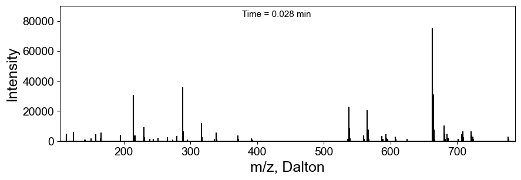
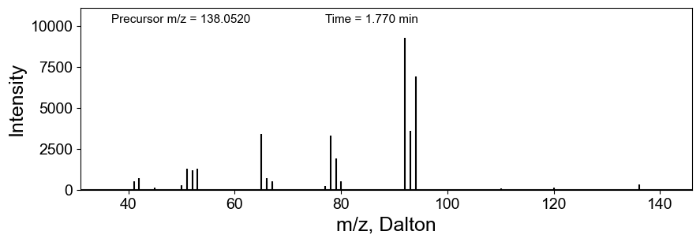
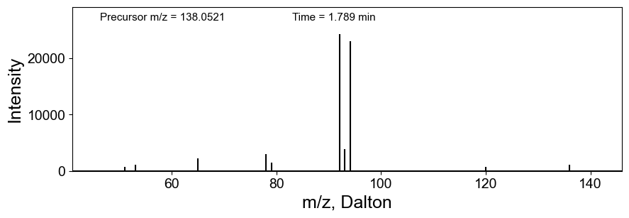

In case you need a [demo data](https://github.com/huaxuyu/masscubedocs/blob/main/static/raw_files/demo_data.mzML) file.

## Visualize a single MS1 or MS/MS scan

Plot by scan index:

```python
from masscube import read_raw_file_to_obj

d  = read_raw_file_to_obj("demo_data.mzML")

# by index
scan_index = 10  # index of the scan to visualize
scan = d.scans[scan_index]  # get the scan object

# example 1
scan.plot_scan()
```

### Example output 1

Plot the scan by index:



Plot MS/MS scans by searching for a specific m/z value and retention time:

```python
from masscube import read_raw_file_to_obj

d  = read_raw_file_to_obj("demo_data.mzML")

# by m/z and retention time
target_mz_arr = 138.0521    # m/z value of the precursor ion.
target_rt = 1.774           # target retention time in minutes. Set it to None to plot the whole retention time range
mz_tol = 0.005,             # m/z tolerance in Da
rt_tol = 0.3,               # retention time tolerance in minutes

# search all available MS/MS scans
scans = d.find_ms2_by_mzrt(target_mz_arr, target_rt, mz_tol=0.005, rt_tol=0.3)

# example 2
for scan in scans:
    scan.plot_scan()
```

### Example output 2

The first MS/MS scan by m/z and retention time:



The second MS/MS scan by m/z and retention time:


