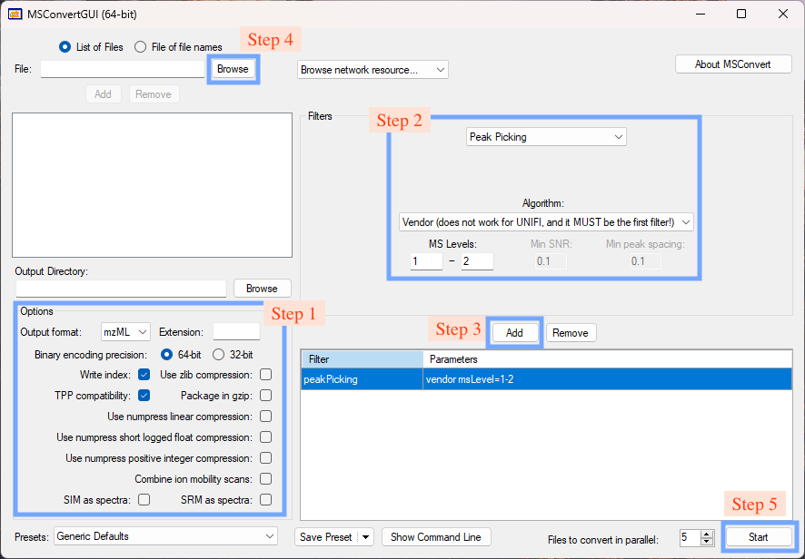

## File conversion

Raw LC-MS data need to be converted to **mzML** or **mxXML** format.


   Only **centroid** data are supported in *masscube* to maximize the speed and reduce the memory usage.


We recommend to use **ProteoWizard** for file conversion.

### Download and install ProteoWizard

Visit the [official website](https://proteowizard.sourceforge.io/download.html) to download ProteoWizard.

### File conversion using MSConvert



* **Step 1. Set options**

Check the boxes as shown in **Fig. 1**.


   Do NOT check **Use Zlib compression**.


* **Step 2. Set the Peak Picking filter**

* **Step 3. Add the Peak Picking filter**

* **Step 4. Browse and load files**

* **Step 5. Start conversion**

By default, the converted files will be saved in the same directory as the raw files.


   You can also convert files using MSConvert in command line mode. For more information, please refer to the [documentation](https://proteowizard.sourceforge.io/tools/msconvert.html).



## Parameter file

A parameter file (.csv) is used to set parameters for the workflow. A templete is provided [here](). If not provided, the [default parameters](../parameter) will be applied.


## Sample table (Untargeted metabolomics workflow)

A sample table (.csv) is used to claim the name of samples and their groups including biological groups, quality control samples, or blank samples. A templete is provided [here]().

For large-scale metabolomics data, it's not easy to prepare the sample table manually. In *masscube*, we provide a function to automatically generate the sample table based on the file names in the data folder, and users can further define the groups.

### Generate sample table

In the project folder, open a terminal and run the following command:

```bash
generate-sample-table
```